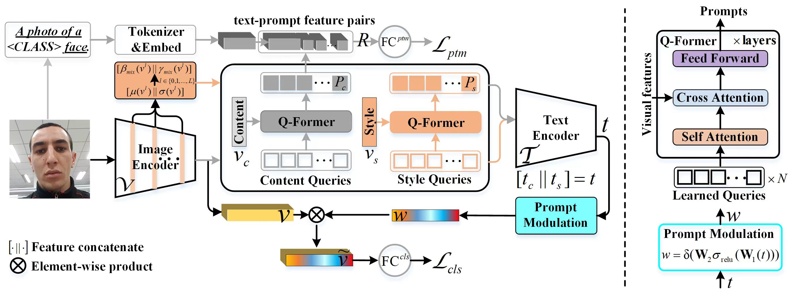

<h1 align="center">CFPL-FAS: Class Free Prompt Learning for Generalizable Face Anti-spoofing</h1>

<div align='center'>
    <a href='https://github.com/liuajian' target='_blank'><strong>Ajian Liu</strong></a>&emsp;
    <a href='https://scholar.google.com/citations?user=isWtY64AAAAJ&hl=zh-CN' target='_blank'><strong>GoogleScholar</strong>&emsp;
</div>
<div align='center'>
    </sup>CBSR, MAIS, CASIA&emsp;
</div>


<p align="center">
  
  <br>
  For more information, visit my <a href="https://liuajian.github.io/"><strong>Homepage</strong></a>
</p>

## 🔥 Updates
- **`2024/12/12`**: We have built an initial version of the [CASIA-FAS-Benchmark](https://github.com/liuajian/CASIA-FAS-Benchmark). Continuous updates!
- **`2024/12/05`**: We have restructured the management format of the face anti-spoofing datasets, [CASIA-FAS-Dataset](https://github.com/liuajian/CASIA-FAS-Dataset). Continuous updates!

## Introduction 📖
This repo, named **CASIA-FAS-Benchmark**, contains the official PyTorch implementation for our series of papers).
We are actively updating and improving this repository. If you find any bugs or have suggestions, welcome to raise issues or submit pull requests (PR) 💖.

## Getting Started 🏁
### 1. Clone the code and prepare the environment 🛠️

```bash
git clone https://github.com/liuajian/CASIA-FAS-Benchmark
cd CASIA-FAS-Benchmark

# create env using conda
conda create -n FAS python=3.10
conda activate FAS
```

### 2. Install dependency packages 📦
> This code is built on top of the awesome toolbox [Dassl.pytorch](https://github.com/KaiyangZhou/Dassl.pytorch) so you need to install the `dassl` environment first. Simply follow the instructions described [here](https://github.com/KaiyangZhou/Dassl.pytorch#installation) to install `dassl` as well as PyTorch. After that, run `pip install -r requirements.txt` under `CASIA-FAS-Benchmark/` to install a few more packages required by [CLIP](https://github.com/openai/CLIP) (this should be done when `dassl` is activated). Then, you are ready to go.

> Follow [DATASETS.md](DATASETS.md) to install the datasets. Place the dataset folder `CASIA-FAS-Dataset` outside this repo to avoid consuming the processing efficiency of the code editor.

### 3. Parameter Introduction 🎨, Training 💪 and Inference 🚀
> All training and testing scripts in `./scripts` folder, which are executed using the `bash` method. General parameter settings:
```bash
GPU_IDS='0'                          # Specify the GPU card, usually one is sufficient
DATA=CASIA_FasData                   # The path of CASIA-FAS-Dataset
OUTPUT=xxx                           # The path of results
DATASET=c_data/cdi_data/dg_data      # intra-dataset/multimodal-dataset/cross-dataset
PROTOCOL=CASIA_CeFA@p1.1             # data_name@protocol
IS_VIDEO=1/0                         # In one epoch, `1` represents extracting only one frame from a video, and `0` represents using all frames
TRAINER=CLIP/CLIP_CDI                # single-modal/multi-modal dataset
IS_FLEXIBLE=0/1                      # multi-modal fusion/flexible modal
PROMPT=class/engineering/ensembling  # single text template/average of multiple text templates
CFG=vit_b16                          # the type of backbone
```

> We provide benchmark models including: [CLIP-V](https://github.com/openai/CLIP), [CLIP](https://github.com/openai/CLIP), [CoOp](https://github.com/KaiyangZhou/CoOp), where CLIP-V means removing the text branch from the CLIP and replacing it with a fully connected layer based classifier. 🔥 Continuous updates!
```bash
TRAINER=CLIP/CLIP_CDI/CoOp    
VERSION=V/VL                         
```

> We provide train/test scripts for intra-dataset experiments corresponding to the official protocols, including OULU_NPU(O), SiW, IDIAP_WMCA(W), CelebA-Spoof(CA), JFSFDB(J), CASIA_SURF(S), CASIA_CeFA(E), CASIA_HiFiMask(HI), CASIA_SuHiFiMask(SU), UniAttackData(U), UniAttackData++(U++). 🔥 Continuous updates!
```bash
bash scripts/start_c_clip.sh
where: 
DATASET=c_data 
IS_VIDEO=0               
```

> We provide train/test scripts for cross-dataset experiments corresponding to the consensus protocols, including (1) ICMO benchmark: ReplayAttack(I), CASIA_FASD(C), MSU_MFSD(M), OULU_NPU(O); (2) SEW benchmark: CASIA_SURF(S), CASIA_CeFA(E), IDIAP_WMCA(W). [!Note] Only use RGB samples; (3) 3DHISUK2 benchmark: 3DMask(3D), CASIA_HiFiMask(HI), CASIA_SuHiFiMask(SU), HKBUv2. 🔥 Continuous updates!
```bash
bash scripts/start_dg_clip.sh
where:
DATASET=c_data
IS_VIDEO=1  
```

> We provide train/test scripts for flexible modal face anti-spoofing experiments corresponding to the official protocols, including CASIA_SURF(S), CASIA_CeFA(E), IDIAP_WMCA(W). 🔥 Continuous updates!
```bash
bash scripts/start_cdi_clip.sh
where: 
TRAINER=CLIP_CDI
DATASET=cdi_data           # Set up multimodal dataset includes color, depth, and ir modalities
IS_VIDEO=0
IS_FLEXIBLE=1              # Set up flexible modal experiments
IS_FLEXIBLE=0              # Set up multi-modal fusion experiments
```

## Citation 💖
If you find the repo useful for your research, welcome to 🌟 this repo and cite our work using the following BibTeX:
```bibtex
@inproceedings{liu2024cfplfas,
      title={CFPL-FAS: Class Free Prompt Learning for Generalizable Face Anti-spoofing}, 
      author={Ajian Liu and Shuai Xue and Jianwen Gan and Jun Wan and Yanyan Liang and Jiankang Deng and Sergio Escalera and Zhen Lei},
      booktitle={Proceedings of the IEEE/CVF Conference on Computer Vision and Pattern Recognition},
      year={2024}
}
```

## Contact 📧
Name: [**Ajian Liu**](https://liuajian.github.io/); Email: **ajian.liu@ia.ac.cn**


